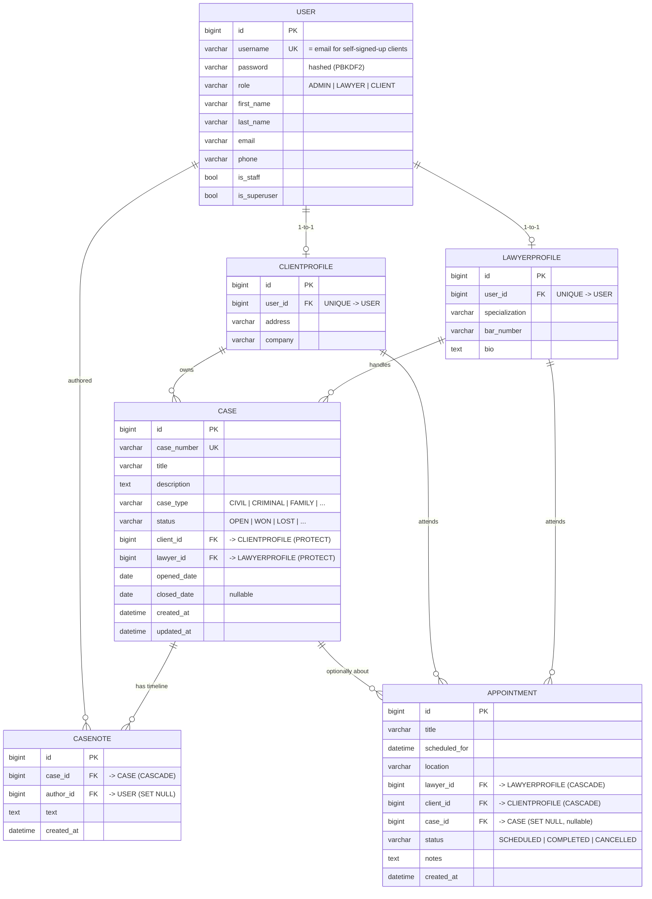

# ⚖️ CaseHarbor — Legal Cases Management System

[](https://github.com/KanishkSigar/CaseHarbor/actions/workflows/ci.yml)
[](https://caseharbor.onrender.com)
[](https://www.python.org/)
[](https://www.djangoproject.com/)
[](https://www.postgresql.org/)
[](LICENSE)

A role-based web application that helps law firms run their day-to-day operations —
**cases, appointments, lawyers and clients** — on top of a clean, normalised
**relational database**. Three roles (Admin, Lawyer, Client) each get a tailored,
access-controlled view, with permissions enforced **at the database-query level**, not
just hidden in the UI.

### 🔗 Live app → **[caseharbor.onrender.com](https://caseharbor.onrender.com)**

> The landing page is public — anyone can **sign up** as a client. Lawyers are created
> by an admin; admins use a separate staff portal. See **[Logging in](#-logging-in)**
> below for the exact steps.
>
> *Note: the free host sleeps when idle, so the first load can take ~30–60 s to wake.*

**Stack:** Django 5/6 · PostgreSQL (Render) · Bootstrap 5 + custom UI · WhiteNoise ·
GitHub Actions CI.

---

## Table of contents
- [Features](#-features)
- [Logging in](#-logging-in)
- [Tech stack](#-tech-stack)
- [Database schema — the heart of the system](#️-database-schema--the-heart-of-the-system)
- [How the database handles everything](#️-how-the-database-handles-everything)
- [Authentication & roles](#-authentication--roles)
- [Getting started (local)](#-getting-started-local)
- [Running the tests](#-running-the-tests)
- [Deployment](#️-deployment)
- [Project structure](#-project-structure)

---

## ✨ Features

| Area | What it does |
|------|--------------|
| **Professional landing page** | Modern, responsive marketing page with a product preview and a live data-model section. Public — no login required. |
| **Self-service sign-up** | Clients register in seconds with just **name + email + password** — the email *is* the login. No username to invent. |
| **Two separate logins** | A **client/lawyer portal** (`/login/`) and an **unadvertised admin portal** (`/staff/login/`). Each rejects the wrong audience. |
| **Password reset** | "Forgot password?" sends an email reset link; logged-in users can change their password from their profile. |
| **My profile** | Every user can edit their own details (name, email, phone — plus company/address or specialisation/bar number). |
| **Cases** | Case number, type, full status workflow (Open → In Progress → Pending → Closed/Won/Lost), assigned lawyer, linked client, description, and a **notes timeline**. |
| **Appointments** | Schedule meetings between a lawyer and a client, optionally tied to a case, with one-click *complete / cancel*. |
| **Lawyers & clients** | Admin CRUD on profiles (specialisation, bar number, company, contact). Each is backed by a real login account. |
| **Search & sorting** | Search cases (number/title/client) and appointments (title/person); sort and paginate large lists. |
| **Role-aware dashboard** | KPI tiles and recent activity, scoped to who you are. |
| **Tested + CI** | A Django test suite (auth, role-scoping, reset) runs on every push via **GitHub Actions**. |
| **No seed clutter** | Ships empty. One `createadmin` command bootstraps the first administrator; all real data is entered through the app. |

---

## 🔑 Logging in

CaseHarbor deliberately has **two separate sign-in portals**.

### 👤 As a client (new user) — public self sign-up
1. On the landing page, click **Sign up** / **Get started**, or go to **`/signup/`**.
2. Enter your **name, email and a password** (6+ characters). No username needed.
3. You're **signed in automatically** and land on your client dashboard.
4. Next time, sign in at **`/login/`** using your **email + password**.

Clients get a private, **read-only** view of *their own* cases and appointments.

### ⚖️ As a lawyer — created by an admin
Lawyers don't self-register. An **admin** creates the account
(**Manage → Lawyers → Add**), which sets a username + password. The lawyer then signs in
at **`/login/`** with that **username (or email) + password**, and sees only the cases
and appointments assigned to them (they can add notes and update status).

### 🛡️ As an admin (staff) — separate portal
1. **Bootstrap the first admin once:**
   - Local: `python manage.py createadmin --username admin --password "ChangeMe@123"`
   - Deployed (no shell): visit `/setup/?username=admin&password=YourStrongPass` once.
2. Sign in at **`/staff/login/`** — a separate, unadvertised window (linked subtly in
   the footer). Admins manage everything, plus the Django admin at **`/admin/`**.

### 🔁 Forgot your password?
Use the **"Forgot password?"** link on the sign-in page (`/password/reset/`). It emails
a reset link. *(Locally, with no SMTP configured, the email prints to the console; set
`EMAIL_HOST`/`EMAIL_HOST_USER`/`EMAIL_HOST_PASSWORD` to send real mail.)*

---

## 🧰 Tech stack

| Layer | Choice |
|-------|--------|
| Backend | **Django** (5.2+ / 6.x), Python 3.12+ |
| Database | **PostgreSQL** in production; **SQLite** for zero-config local dev; MySQL also supported |
| Drivers | `psycopg2-binary` (Postgres), `PyMySQL` (MySQL) |
| Frontend | Django templates + **Bootstrap 5** + custom CSS (navy/gold, Plus Jakarta Sans) |
| Forms | `django-crispy-forms` + `crispy-bootstrap5` |
| Server / static | `gunicorn` + `WhiteNoise` |
| Config | `django-environ` + `dj-database-url` (12-factor, single `DATABASE_URL`) |
| CI | **GitHub Actions** (system check + test suite on every push) |
| Hosting | **Render** (one-blueprint deploy: app + Postgres) |

---

## 🗄️ Database schema — the heart of the system

The entire practice is modelled by **five core tables** plus Django's auth/session
infrastructure. Everything links back to a single `User` table through foreign keys.



### Table-by-table

#### 1. `accounts_user` — one identity table for everyone
A **custom user model** (`AbstractUser` + a `role` column). Instead of three separate
login tables, every person — admin, lawyer or client — is one row here. The `role`
field is the single source of truth that drives every permission decision. For clients
who self-register, the `username` is set to their **email** (so they log in with email).
Passwords are stored hashed (PBKDF2).

#### 2. `accounts_lawyerprofile` / `accounts_clientprofile` — domain data, kept separate
Each is a **one-to-one** extension of `User` (`user_id` is `UNIQUE`). This keeps
role-specific fields (a lawyer's `bar_number`, a client's `company`) out of the auth
table — a clean separation of *who you are* from *what you are in the firm*.

#### 3. `cases_case` — the central entity
Joins a **client** and a **lawyer** together. Both foreign keys use
**`on_delete=PROTECT`** — you cannot delete a client or lawyer who still has cases,
which prevents orphaned legal records. `case_number` is `UNIQUE`; `status` and
`case_type` are constrained to enumerated choices.

#### 4. `cases_casenote` — an append-only timeline
A one-to-many child of `Case` (`on_delete=CASCADE`). The `author` points at `User` with
**`on_delete=SET NULL`**, so the audit trail survives even if the author is removed.

#### 5. `appointments_appointment` — scheduling
References a `lawyer` and a `client` (`CASCADE`) and **optionally** a `case`
(`on_delete=SET NULL`, nullable) — an appointment can exist before a case is opened.

### Why these `on_delete` choices matter
| Relationship | Rule | Reason |
|--------------|------|--------|
| Case → Client / Lawyer | `PROTECT` | Never silently lose a legal record by deleting a person. |
| CaseNote → Case | `CASCADE` | Notes are meaningless without their case. |
| CaseNote → Author | `SET NULL` | Preserve the timeline even if the author leaves. |
| Appointment → Case | `SET NULL` | Appointments outlive / predate cases. |

---

## ⚙️ How the database handles everything

The interesting part isn't just the tables — it's how access rules live **in the data
layer**:

- **Query-level role scoping.** Both `Case` and `Appointment` expose a custom manager
  method `for_user(user)` that returns a different `QuerySet` per role:

  ```python
  # cases/models.py
  class CaseQuerySet(models.QuerySet):
      def for_user(self, user):
          if user.is_admin:   return self                            # sees all
          if user.is_lawyer:  return self.filter(lawyer__user=user)  # WHERE lawyer.user_id = ?
          if user.is_client:  return self.filter(client__user=user)  # WHERE client.user_id = ?
          return self.none()
  ```

  A client literally **cannot** load another client's case — the row never leaves the
  database for them. Isolation is enforced by the query, not the template.

- **Referential integrity** is delegated to the database via foreign keys, so the app
  can't create dangling references even under concurrent writes.
- **Enumerated columns** (`status`, `case_type`, `role`) use Django `TextChoices`.
- **`select_related`** on every list/detail view → one SQL query with joins, no N+1.
- **Migrations** are the schema's version control under each app's `migrations/`.

---

## 🔐 Authentication & roles

| Role | Logs in at | Can do |
|------|-----------|--------|
| **Admin** | `/staff/login/` (separate, unadvertised) | Everything: manage lawyers, clients, cases, appointments, plus Django admin. |
| **Lawyer** | `/login/` (client/lawyer portal) | See & manage **only their** assigned cases and appointments; add notes; update status. |
| **Client** | `/login/` (signs up at `/signup/`) | **Read-only** view of their own cases and appointments. |

The two portals reject the wrong audience: an admin who tries the public portal is told
to use the staff portal, and a non-admin who finds the staff portal is refused. Access
is enforced server-side by `RoleRequiredMixin` / `AdminRequiredMixin`
(`accounts/mixins.py`) **on top of** the query scoping above. Sign-up always creates a
`CLIENT` (the role is fixed server-side and can't be escalated from form input).

---

## 🚀 Getting started (local)

```bash
git clone https://github.com/KanishkSigar/CaseHarbor.git
cd CaseHarbor

python -m venv venv
venv\Scripts\activate          # macOS/Linux: source venv/bin/activate
pip install -r requirements.txt

copy .env.example .env         # macOS/Linux: cp .env.example .env
```

The default `.env` uses **SQLite**, so there's **no database server to set up**:

```ini
DB_ENGINE=sqlite
```

**Run it:**

```bash
python manage.py migrate
python manage.py createadmin --username admin --password "ChangeMe@123"
python manage.py runserver 8800
```

Open **http://127.0.0.1:8800/**, then:
- **Try it as a client:** click **Sign up** → register with an email → you're in.
- **Manage as admin:** go to **`/staff/login/`**, sign in as `admin`, and create
  lawyers/clients/cases from the **Manage** menu.

> If port 8000 gives *"You don't have permission to access that port"* on Windows,
> it's reserved by Hyper-V/WSL — just use another port like `8800`.

---

## ✅ Running the tests

```bash
python manage.py test
```

15 tests cover sign-up, the no-username/email login, role-injection protection,
profile editing, password reset, and case/appointment **role-scoping**. The same suite
runs in CI on every push (`.github/workflows/ci.yml`).

---

## ☁️ Deployment

**Render (recommended, free, one click):** the repo ships a `render.yaml` blueprint that
provisions a **free PostgreSQL database and the web service together** and links them
automatically — no credentials to copy, `SECRET_KEY` auto-generated, migrations run at
build.

1. **render.com → New → Blueprint → pick this repo → Apply.**
2. Wait for it to go **Live**, then create your admin once by visiting
   `https://<your-service>.onrender.com/setup/?username=admin&password=YourStrongPass`.
3. Sign in at `/staff/login/`.

Static files are served by WhiteNoise; the app reads a single `DATABASE_URL`, so it also
runs on any other Postgres/MySQL host. See **[DEPLOYMENT.md](DEPLOYMENT.md)** for the
full step-by-step (incl. an alternative Vercel + MySQL path).

---

## 📁 Project structure

```
config/         # settings (env + DATABASE_URL), root URLs, WSGI
accounts/       # custom User + roles, profiles, landing, sign-up, dual logins,
                #   password reset, dashboard, lawyer/client management, createadmin
cases/          # Case + CaseNote models, role-scoped views, search, notes timeline
appointments/   # Appointment model and scheduling views
templates/      # Bootstrap 5 templates (landing, auth, app pages)
static/         # theme CSS
docs/           # static project overview (GitHub Pages)
render.yaml     # Render blueprint (web service + Postgres)
.github/        # GitHub Actions CI workflow
```

---

## 🧭 Roadmap / out of scope (next iterations)
Document uploads per case (needs cloud storage) · billing & invoicing · email/SMS
appointment reminders · a calendar view · client-initiated appointment requests.

---

## 🤝 Acknowledgments
Developed with the assistance of AI-powered coding tools (Claude Code) for parts of
the implementation and documentation.
